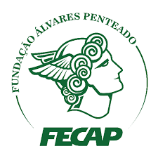
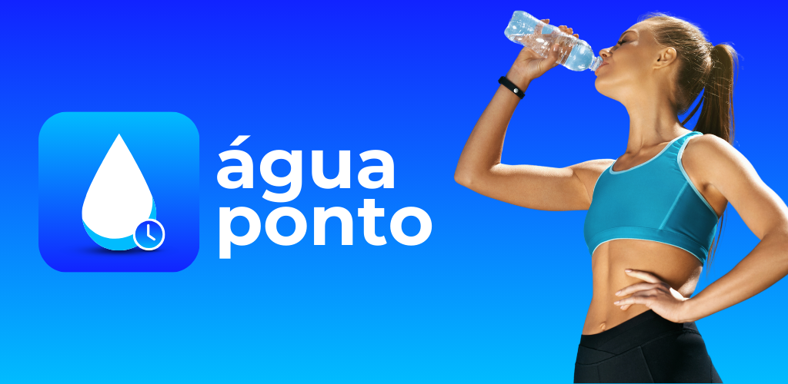

# FECAP - Fundação de Comércio Álvares Penteado

  

# Água Ponto
## Tropa do Fura Bloqueio

## Integrantes: [Lucca Gomes Vieira](https://br.linkedin.com/in/luccagvieira), [Luigi Augusto Bezera Consentino](https://br.linkedin.com/in/luigi-consentino-144566265), [Mateus Macedo Batista de Souza](https://www.linkedin.com/in/mateus-macedo97732), [Mateus Sousa Piccinin](https://www.linkedin.com/in/mateusspiccinin).

## Professores Orientadores: [Victor Rosetti](https://www.linkedin.com/in/victorbarq/), [Adriano Felix](https://br.linkedin.com/in/adriano-valente-534576135).

## Descrição

  
  
Água Ponto by Tropa do Fura Bloqueio

O Água Ponto é um aplicativo projetado para ajudar os usuários a manter uma rotina de hidratação saudável. O aplicativo envia lembretes regulares para garantir que você beba água ao longo do dia e oferece relatórios detalhados sobre seu consumo de água.

O Água Ponto também permite personalizar os lembretes de acordo com o seu estilo de vida e horários, garantindo que você nunca esqueça de beber água, mesmo durante dias agitados. Além disso, o aplicativo utiliza gráficos intuitivos para apresentar seu progresso, ajudando você a visualizar facilmente seu consumo de água e a identificar padrões de hidratação ao longo do tempo.

## 🛠️ Estrutura de pastas

-Raiz  
|  
|-->documentos  
 |-->antigos  
 |-->Documentação.docx  
|-->executáveis  
 |-->windows  
 |-->android  
 |-->HTML  
|-->imagens  
|-->src  
 |-->Backend  
 |-->Frontend  
|readme.md  

## 🛠️ Instalação

<b>Android:</b>

Faça o Download do aguapontoapk.apk no seu celular.
Execute o APK e siga as instruções de seu telefone.

<b>Windows:</b>

Não há instalação! Apenas executável!

<b>HTML:</b>

Não há instalação!

## 💻 Configuração para Desenvolvimento

Não é necessário a instalação de nenhuma dependência, pacote ou biblioteca adicional para o funcionamento correto do app.

## 🗃 Histórico de lançamentos

* 0.1.0 - 25/05/2024
    * Primeiro lançamento
    

## 📋 Licença/License

Não possui licenças!

## 🎓 Referências

Aqui estão as referências usadas no projeto.

https://www.youtube.com/watch?v=PFOJo8T4VIk&list=PLizN3WA8HR1zBnD25H2I4T57T8D4RcmWQ  
https://www.youtube.com/watch?v=b7OoeiG_BzU  
https://dribbble.com/  
https://www.behance.net/  
https://www.tuasaude.com/calculadora/consumo-de-agua-diario/  
https://www.unimed.coop.br/viver-bem/saude-em-pauta/a-importancia-da-agua-no-corpo-humano-tire-todas-as-suas-duvidas  

